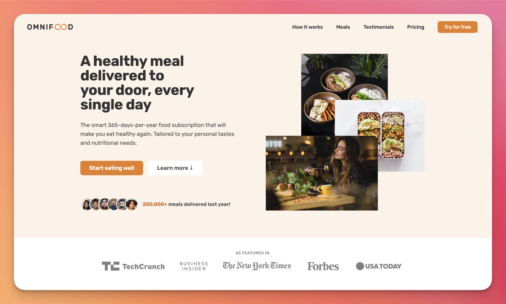

# Omnifood - Website

The 'Omnifood' website is a responsive example project showcasing a healthy meal delivery service. It features a clean and modern design built primarily with HTML CSS and some JavaScript. The website highlights the service's focus on healthy meal options and includes subscription models for convenient meal planning and delivery.

Link: https://omnifood-anshu-sinha.netlify.app

---

## 📸 Screenshots

---

## ✨ Features

- Responsive Design: Optimized for all screen sizes (desktop, tablet, and mobile). Flexible layout adapting seamlessly to various devices.
- Subscription Models: Users can choose meal plans based on preferences and duration. Highlights pricing and benefits of each subscription tier.
- Modern UI/UX: Clean, professional, and visually appealing design. Emphasis on user-friendly navigation and readability.
- Showcasing Health Focus: Promotes healthy living and food choices. Uses images and descriptions to highlight nutritious meals.
- Interactive Features: Call-to-action buttons for exploring menus or subscribing. Simple JavaScript interactions for enhancing user experience.

---

## ⚙️ Tech Stack

- HTML: Structure and content of the website.
- CSS: Custom styling for layout and aesthetics. Used techniques like Flexbox and media queries for responsiveness.
- JavaScript (Minimal): Basic interactivity, such as form validation or interactive UI elements.
